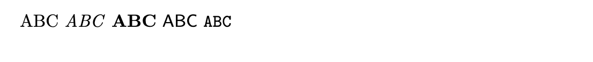
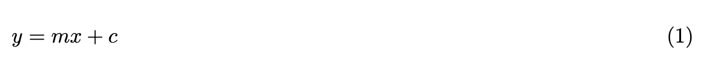
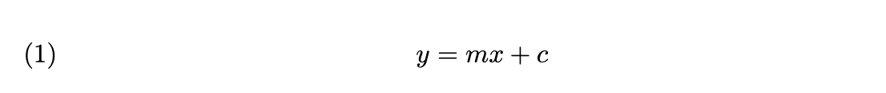

---
## Author
author:
  name: Филибер Никола
  degrees: Магистратура
  orcid: 0000-0000-0000-0000
  email:
  affiliation:
    - name: Российский университет дружбы народов
      country: Российская Федерация
      postal-code: 117198
      city: Москва
      address: ул. Миклухо-Маклая, д. 6

## Title
title: "Лабораторная работа №3"
subtitle: "Набор математических формул в LaTeX"
license: "CC BY"
date: today
date-format: "YYYY-MM-DD"
---

# Введение

## Цель работы

- Изучить математический режим LaTeX
- Научиться оформлять формулы
- Изучить возможности пакета `amsmath`

# Математический режим

## Inline и Display

Строчная(inline) формула:

```latex
$y = mx + c$
```

Результат:

$y = mx + c$

Выключная(display) формула:

```latex
\[
y = mx + c
\]
```

$$
y = mx + c
$$

## Индексы и функции

```latex
$a^{b}$

$a_{b}$

$y = 2 \sin \theta^{2}$
```

Результат:

$a^{b}$, $a_{b}$

$y = 2 \sin \theta^{2}$

# Пакет amsmath

## Уравнения

Подключение пакета:

```latex
\usepackage{amsmath}
```

Несколько уравнений:

```latex
\begin{align*}
a &= b + 1 \\
c &= d + 2
\end{align*}
```

Результат:

${a}$ = $b$ + 1 

$c$ = $d$ + 2

## Матрицы

```latex
\[
\begin{pmatrix}
a & b & c \\
d & e & f
\end{pmatrix}
\]
```

Результат:

$$
\begin{pmatrix}
a & b & c \\
d & e & f
\end{pmatrix}
$$

# Дополнительные возможности оформления формул

## Unicode Math(Греческие буквы)

Cтрочные и прописные греческие буквы:

```latex
$\alpha, \beta, \gamma, \theta$

$\Gamma, \Delta, \Omega$
```

Результат:

$\alpha, \beta, \gamma, \theta$

$\Gamma, \Delta, \Omega$

## Математические шрифты

Различные математические шрифты:

```latex
$\mathrm{ABC}$
$\mathit{ABC}$
$\mathbf{ABC}$
$\mathsf{ABC}$
$\mathtt{ABC}$
```


прямой, курсивный, полужирный, шрифт без засечек и моноширинный шрифты.

## Положение формул

```latex
\documentclass[fleqn]{article}
```

`fleqn` размещает выключные формулы по левому краю.



## Положение формул

```latex
\documentclass[leqno]{article}
```

`leqno` размещает номера уравнений слева.



# Результаты

## Результаты работы

- Изучены режимы inline и display
- Созданы формулы с индексами
- Добавлены греческие буквы
- Проверены математические шрифты
- Использован пакет `amsmath`
- Проверены параметры `fleqn` и `leqno`

# Заключение

Изучены основные способы набора и оформления математических формул в LaTeX.